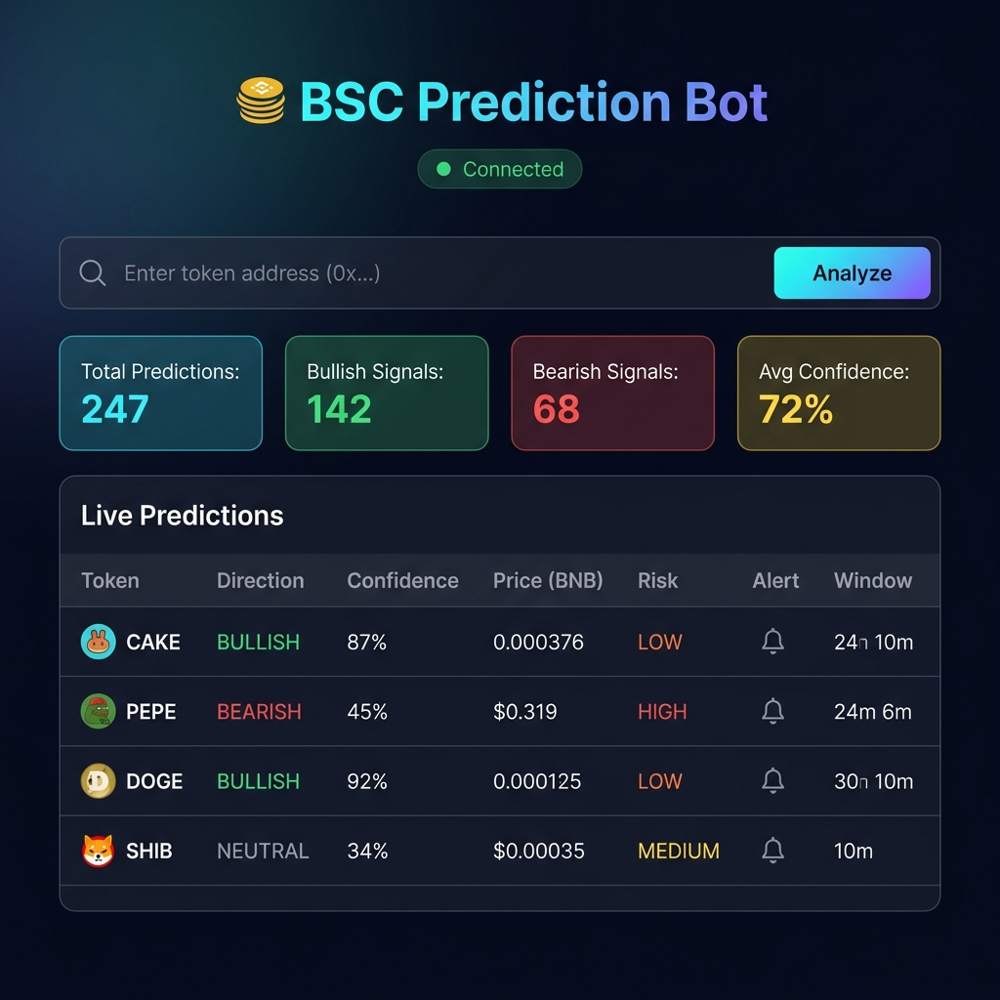
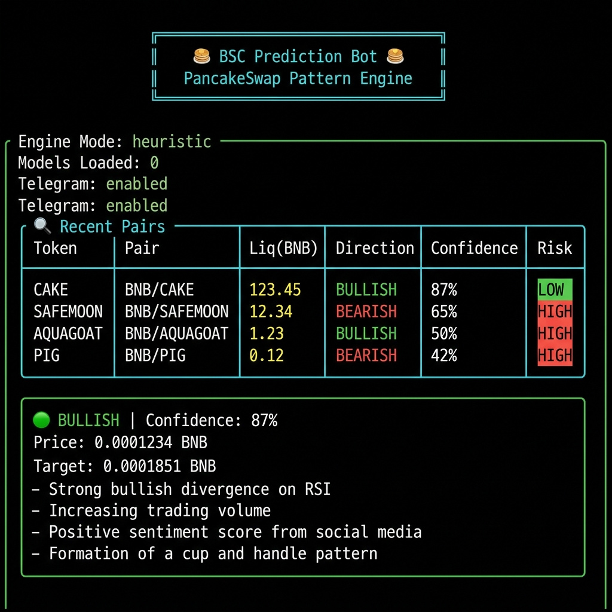
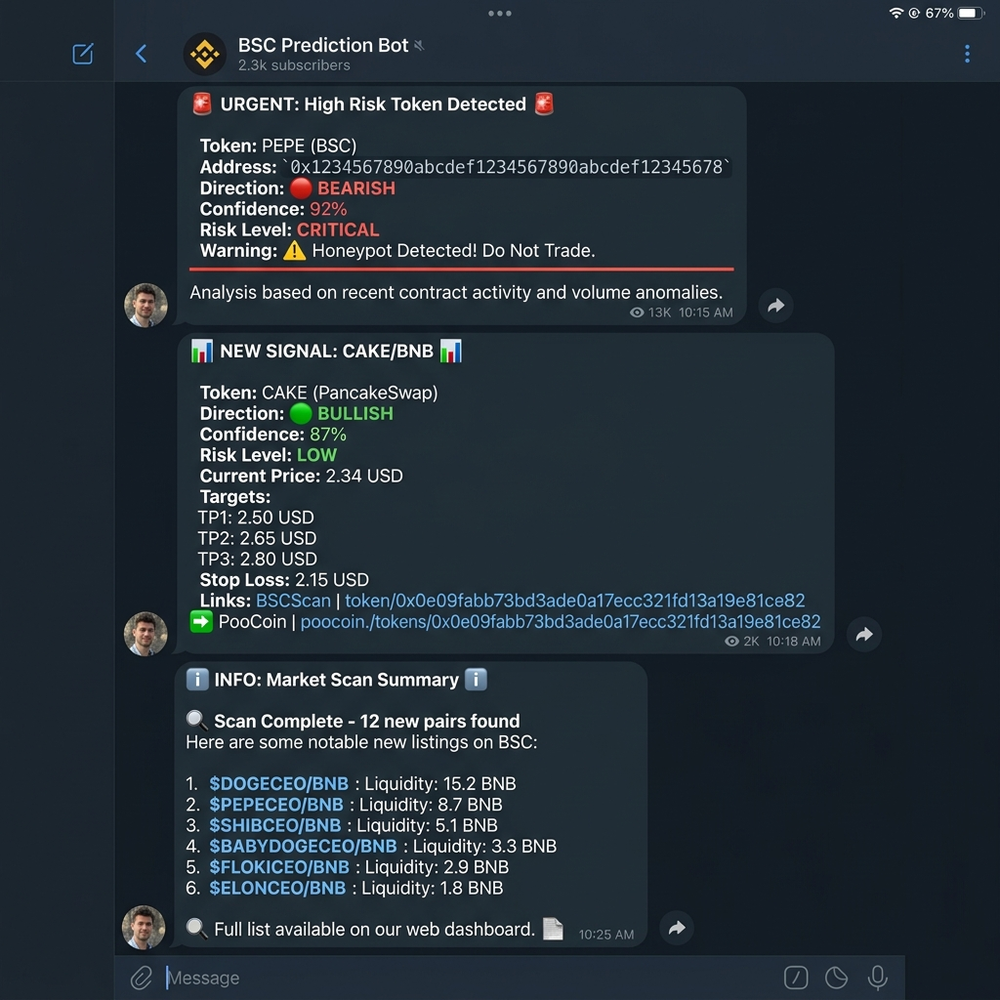

# 🥞 BSC Prediction Bot

<div align="center">

**PancakeSwap On-Chain Pattern Recognition Engine**

*Real-time BNB Chain token analysis with AI-powered pattern detection, contract risk assessment, and instant Telegram alerts.*

[](https://python.org)
[](LICENSE)
[](https://pancakeswap.finance)
[](https://bscscan.com)

</div>

---

## 📸 Screenshots

### 🖥️ Web Dashboard
Real-time predictions with live WebSocket updates, confidence scoring, and risk indicators.

<div align="center">

</div>

### 💻 CLI Interface
Rich terminal output with color-coded tables, prediction panels, and risk reports.

<div align="center">

</div>

### 📱 Telegram Alerts
Instant notifications with detailed token analysis, risk warnings, and quick links.

<div align="center">

</div>

---

## 🏗️ Architecture

```
┌─────────────────────────────────────────────────────────────────┐
│                    BSC Prediction Bot                           │
├─────────────────────────────────────────────────────────────────┤
│                                                                 │
│  ┌──────────────-┐  ┌──────────────┐  ┌──────────────────────┐  │
│  │  CLI (Rich)   │  │  Web API     │  │  Telegram Bot        │  │
│  │  scan/monitor │  │  (FastAPI)   │  │  (python-telegram)   │  │
│  │  backtest     │  │  WebSocket   │  │  Rate-limited alerts │  │
│  └──────┬─────-──┘  └──────┬───────┘  └──────────┬───────────┘  │
│         │                 │                      │              │
│  ┌──────┴─────────────────┴──────────────────────┴───────────┐  │
│  │                  Prediction Engine                        │  │
│  │  ┌──────────────┐ ┌────────────────┐ ┌─────────────────┐  │  │
│  │  │ Pattern      │ │ Risk           │ │ Model Registry  │  │  │
│  │  │ Matcher      │ │ Analyzer       │ │ (CDN + SHA256)  │  │  │
│  │  │ • Pump/Dump  │ │ • Honeypot     │ │ • Versioned     │  │  │
│  │  │ • Accum.     │ │ • Ownership    │ │ • Auto-update   │  │  │
│  │  │ • Sandwich   │ │ • LP Lock      │ │ • Heuristic     │  │  │
│  │  │ • Whale      │ │ • Holders      │ │   fallback      │  │  │
│  │  │ • Fibonacci  │ │                │ │                 │  │  │
│  │  └──────────────┘ └────────────────┘ └─────────────────┘  │  │
│  └───────────────────────┬───────────────────────────────────┘  │
│                          │                                      │
│  ┌───────────────────────┴───────────────────────────────────┐  │
│  │                  Blockchain Layer                         │  │
│  │  ┌──────────────┐ ┌────────────────┐ ┌─────────────────┐  │  │
│  │  │ BSC Client   │ │ PancakeSwap    │ │ Mempool         │  │  │
│  │  │ (Web3.py)    │ │ Router/Factory │ │ Monitor         │  │  │
│  │  │ • Multi RPC  │ │ • Pair queries │ │ • WebSocket     │  │  │
│  │  │ • Failover   │ │ • Price calc   │ │ • Pending TX    │  │  │
│  │  │ • BSCScan    │ │ • Swap decode  │ │ • Gas patterns  │  │  │
│  │  └──────────────┘ └────────────────┘ └─────────────────┘  │  │
│  └───────────────────────┬───────────────────────────────────┘  │
│                          │                                      │
│  ┌───────────────────────┴───────────────────────────────────┐  │
│  │             Data & In-Memory Cache Layer                  │  │
│  │  ┌──────────────┐ ┌────────────────┐ ┌─────────────────┐  │  │
│  │  │ Data Fetcher │ │ Cache Layer    │ │ SQLite DB       │  │  │
│  │  │ • Metrics    │ │ • In-memory    │ │ • Predictions   │  │  │
│  │  │ • History    │ │ • TTL support  │ │ • Token cache   │  │  │
│  │  │ • Aggregator │ │ • Thread-safe  │ │ • Pair history  │  │  │
│  │  └──────────────┘ └────────────────┘ └─────────────────┘  │  │
│  └───────────────────────────────────────────────────────────┘  │
└─────────────────────────────────────────────────────────────────┘
```

---

    📞 [Support](https://t.me/Web3BotSupport) 
    
    24/7 Live Support: [@Web3BotSupport](https://t.me/Web3BotSupport) on Telegram  
    Get help with setup, configuration, or troubleshooting — real humans, round the clock.

## ✨ Features

### 🔮 Prediction Engine
- Real-time liquidity addition/removal analysis
- Sandwich attack pattern detection
- Accumulation pattern identification (multiple small buys from new wallets)
- Dev wallet behavior tracking
- Fibonacci retracement price targets
- Confidence scoring (0-100) with direction and time window

### 📡 Mempool Monitoring
- WebSocket connection to BSC nodes for pending tx stream
- PancakeSwap router interaction filtering
- Large buy/sell pre-confirmation detection
- Sniper bot activity pattern recognition
- Gas price anomaly detection (whale incoming)

### 🔍 Contract Analysis
- BSCScan API source code verification
- Honeypot pattern detection (transfer restrictions)
- Ownership renounced status verification
- LP lock status checking
- Token distribution analysis (top 10 holder concentration)

### 🧠 Model Registry
- Pattern recognition model downloads from CDN
- Versioned `.dat` binary files with SHA256 verification
- Automatic update checks on startup
- Graceful fallback to heuristic mode
- Threaded download with progress reporting

### 📢 Multi-Channel Alerts
- **Telegram Bot** — Real-time alerts with rich formatting
- **Web Dashboard** — Live predictions via WebSocket
- **CLI Output** — Rich console tables and panels
- Configurable alert thresholds (INFO, SIGNAL, URGENT)
- Rate-limited to prevent spam

---

## 🚀 Quick Start

### Prerequisites
- **Python 3.10+** (Windows, {MacOs support will be added soon.})
- **BSCScan API key** (recommended, for contract analysis)

> **No external services required!** The bot runs entirely self-contained — no Redis, no PostgreSQL, no Docker needed.

### Installation

```bash
git clone https://github.com/AiPCSbotcoder/Pancakeswap-Ai-Predict-bot.git
cd Pancakeswap-Ai-Predict-bot
pip install -r requirements.txt
cp .env.example .env    # Edit with your API keys (If you want, you can also make these settings in the GUI.)
python -m src.main scan
```

### Configuration

Edit `.env` with your settings:

| Variable | Description | Required |
|----------|-------------|----------|
| `BSC_RPC_URL` | Primary BSC RPC endpoint | Yes |
| `BSCSCAN_API_KEY` | BSCScan API key for contract analysis | Recommended |
| `MODEL_REGISTRY_URL` | CDN URL for model downloads | No (heuristic mode) |
| `TELEGRAM_BOT_TOKEN` | Telegram bot token for alerts | For alerts |
| `TELEGRAM_CHAT_ID` | Telegram chat/channel ID | For alerts |

### Usage

```bash
# One-time scan of recent pairs
python -m src.main scan --count 20

# Continuous monitoring mode
python -m src.main monitor --interval 10

# Start web dashboard
python -m src.main serve --port 8080

# Backtest a specific token
python -m src.main backtest --pair 0x...
```

---

## 📁 Project Structure

```
Pancakeswap-Ai-Predict-bot/
├── src/
│   ├── __init__.py
│   ├── main.py                  # Entry point, CLI + continuous mode
│   ├── predictor/
│   │   ├── engine.py            # Core prediction logic
│   │   ├── model_registry.py    # Model versioning & CDN downloads
│   │   ├── pattern_matcher.py   # Detect known pump patterns
│   │   └── risk_analyzer.py     # Contract risk assessment
│   ├── blockchain/
│   │   ├── bsc_client.py        # BSC RPC (QuickNode/ANKR)
│   │   ├── pancake_router.py    # PancakeSwap v2/v3 interactions
│   │   ├── mempool_monitor.py   # Monitor pending transactions
│   │   └── pair_scanner.py      # Scan new LP pairs
│   ├── data/
│   │   ├── fetcher.py           # Price, volume, liquidity data
│   │   ├── cache.py             # In-memory cache with TTL
│   │   └── models/              # Downloaded model storage
│   ├── telegram/
│   │   ├── bot.py               # Alert bot
│   │   └── formatters.py        # Message formatting
│   └── utils/
│       ├── config.py            # Configuration management
│       ├── logging_setup.py     # Structured logging
│       └── retry.py             # Retry logic for RPC calls
├── web/
│   ├── dashboard.html           # Web dashboard
│   ├── app.py                   # FastAPI server
│   └── static/
│       └── style.css
├── scripts/
│   ├── setup_db.py              # Database setup
│   └── historical_scan.py       # Historical pair scanning
├── tests/
│   ├── conftest.py              # Test fixtures
│   ├── test_pattern_matcher.py  # Pattern matcher tests
│   └── test_bsc_client.py       # BSC client tests
├── docs/
│   └── screenshots/             # Documentation images
├── requirements.txt
├── .env.example
├── .gitignore
├── README.md
└── LICENSE
```

---

## ❓ FAQ

<details>
<summary><b>Can the bot run without models?</b></summary>

Yes! The bot automatically falls back to heuristic mode when `MODEL_REGISTRY_URL` is not set or models are unavailable. Heuristic mode uses on-chain pattern matching and risk analysis without ML models.
</details>

<details>
<summary><b>Which RPC endpoints are supported?</b></summary>

QuickNode (priority), ANKR, and public BSC dataseed endpoints. The client automatically fails over between endpoints if one goes down.
</details>

<details>
<summary><b>How does the risk analysis work?</b></summary>

The risk analyzer checks contract source code for honeypot patterns, verifies ownership renounced status, analyzes holder distribution (top 10 concentration), and checks LP lock status via BSCScan API.
</details>

<details>
<summary><b>Are there any external service dependencies?</b></summary>

No. The bot is fully self-contained. Cache is in-memory with TTL support, database is local SQLite, and all data comes from BSC RPC endpoints and BSCScan API.
</details>

<details>
<summary><b>How are alerts rate-limited?</b></summary>

Each token address has a cooldown period (default 30 seconds) between alerts. The minimum confidence threshold (default 65%) and alert level filter also prevent noise.
</details>

<details>
<summary><b>Does it work on Windows?</b></summary>

Yes. The bot runs on any OS with Python 3.10+ — Windows, macOS, and Linux are all supported out of the box.
</details>

---

## 📄 License

MIT License — see [LICENSE](LICENSE) for details.
